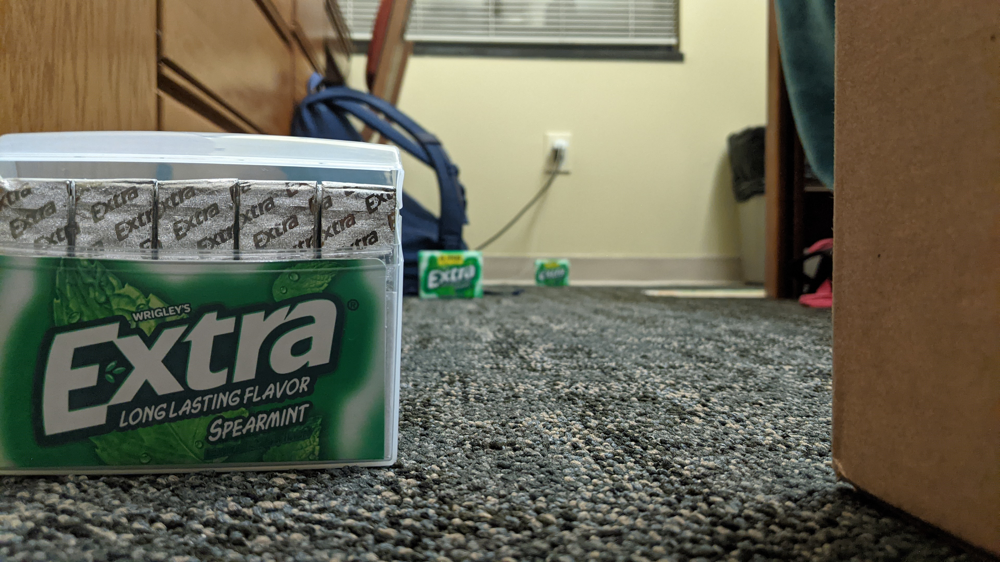
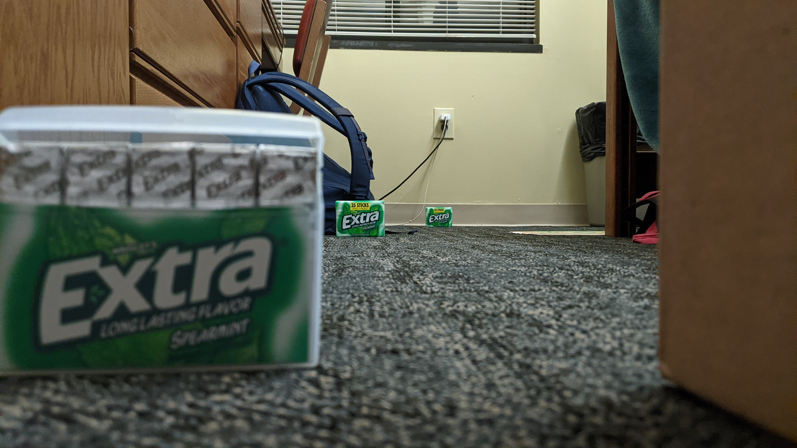
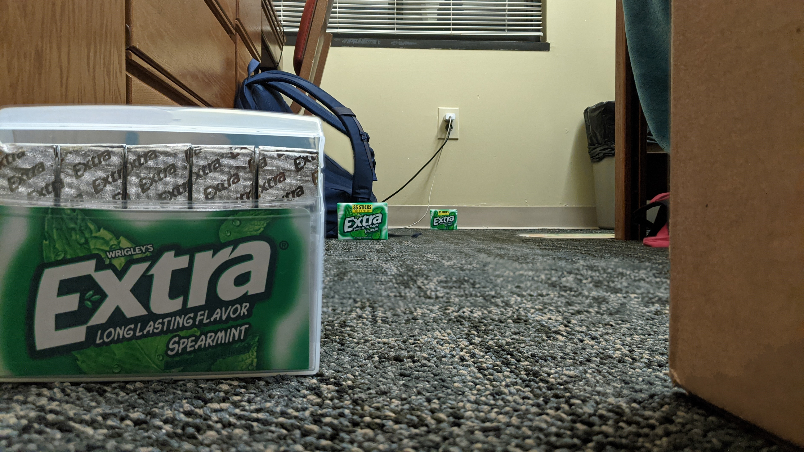
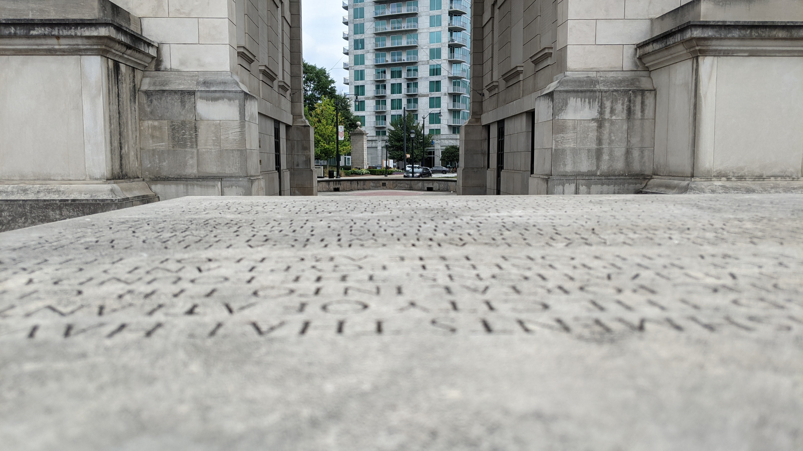
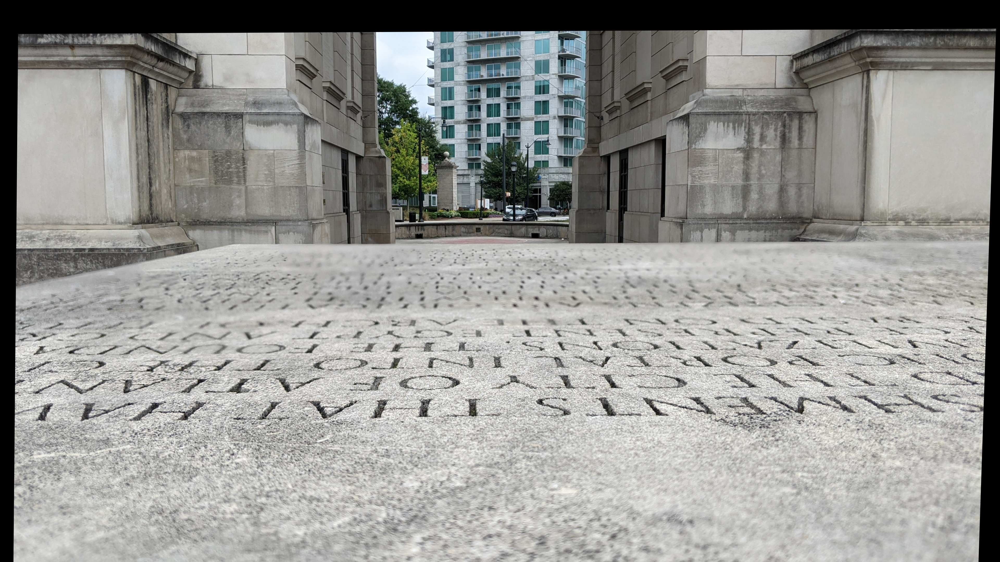
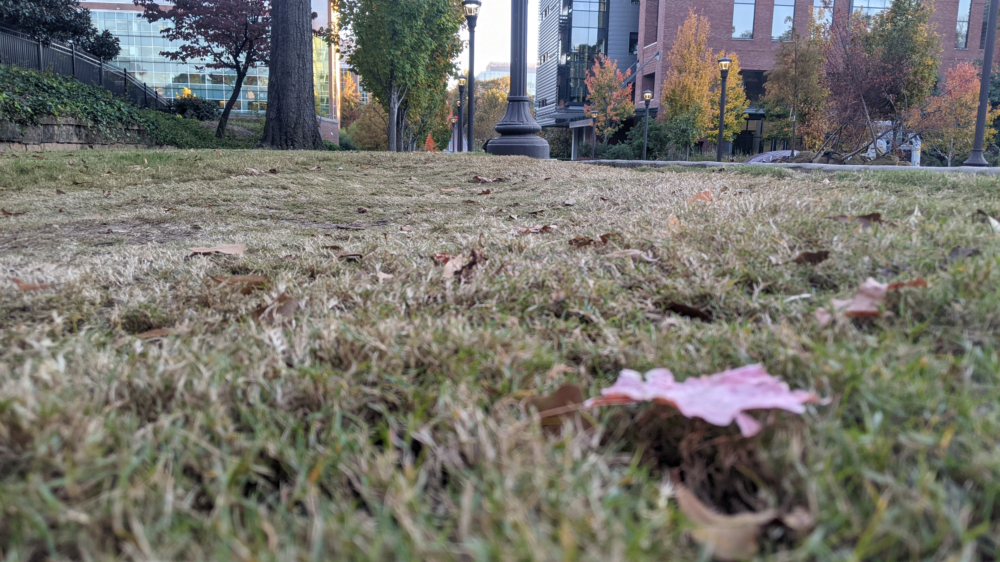
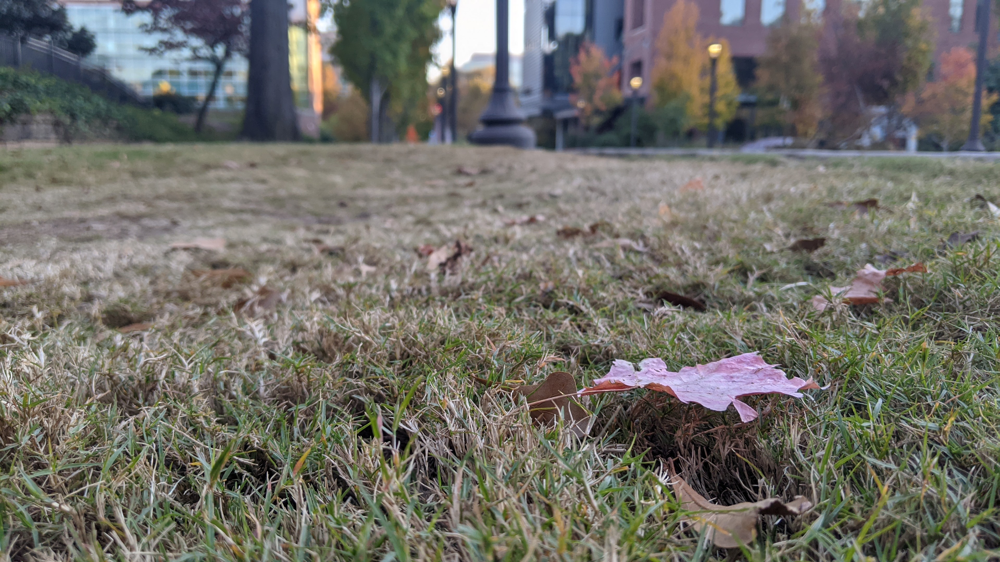
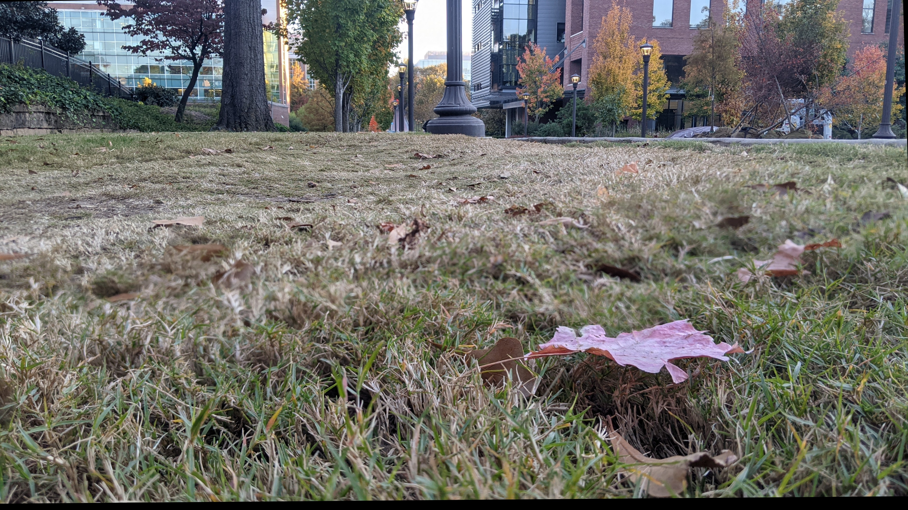

# Focal Stacking App
Develop an Android App to create focal stacked images. 

### Focus Stacking Image Fusion
My high level idea was to take two images taken with different focal distances and create a single image by choosing the sharpest pixels from each image. From my brief exposure to contrast based autofocus, I saw how a sobel filter can be used to calculate a pixelwise gradient and can be used to estimate overall image sharpness. This is like high dynamic range but with sharpness instead of brightness.

### Android App
Under development. I plan to let the Google Pixel to the heavy lifting and grab two or more images at the end of the ISP pipeline. I plan on using OpenCV with Android Studio.

### Examples
| Focal Position 1 | Focal Position 2 | Composite |
:-------------------------:|:-------------------------:|:-------------------------:
 |  | 
 |  | 
 |  | 
